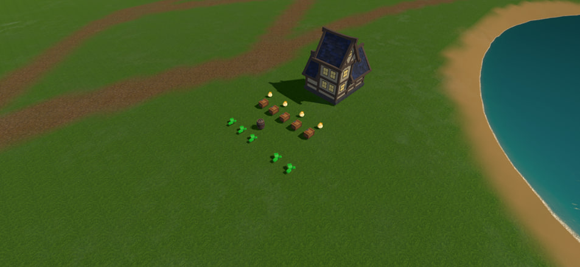
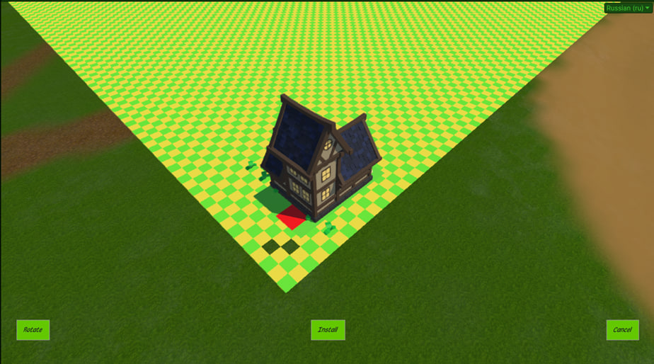
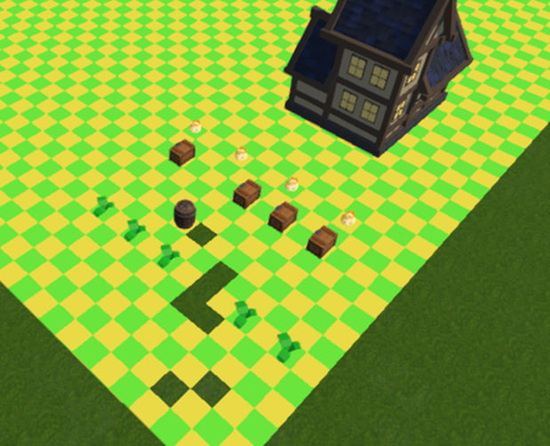
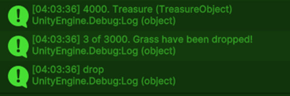
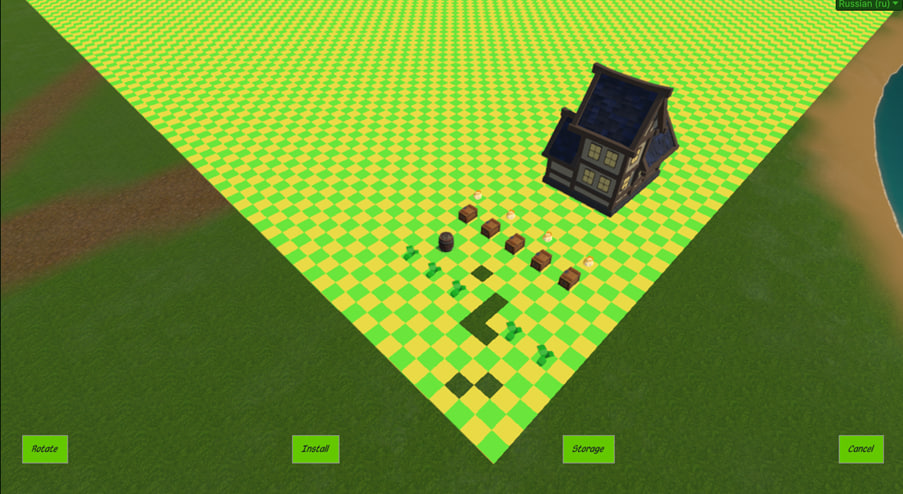
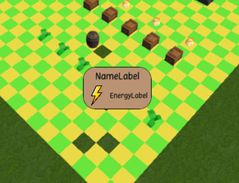
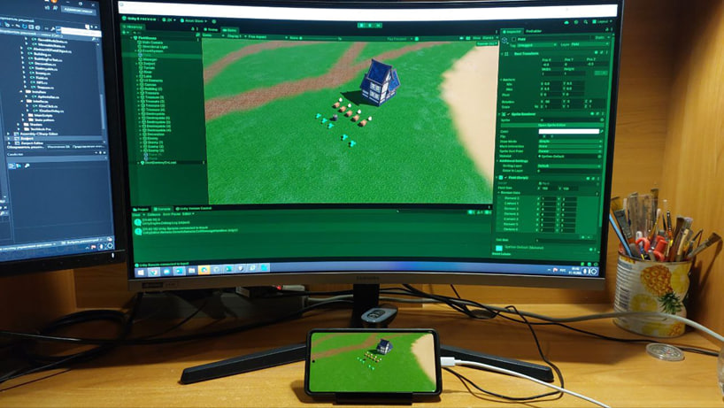
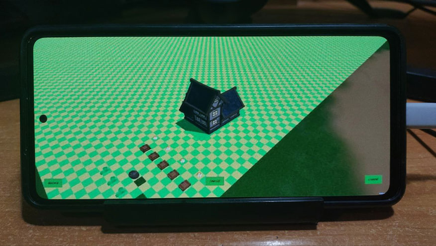
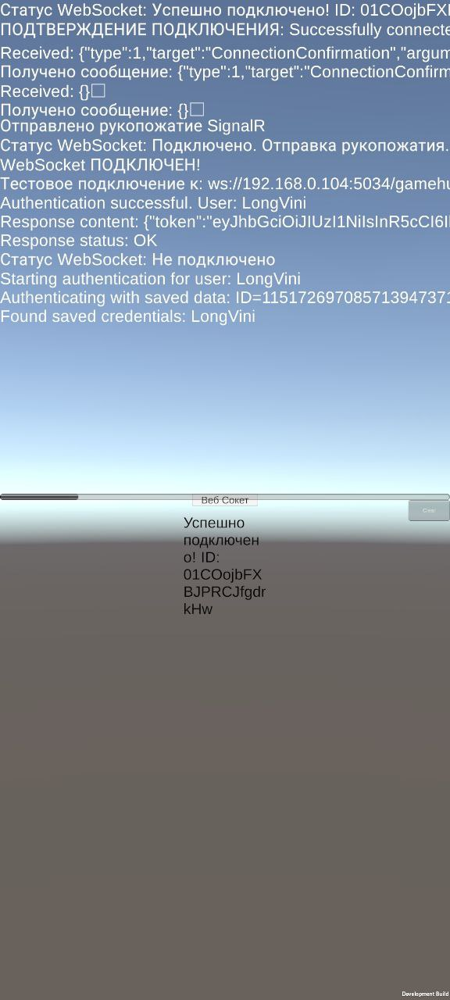
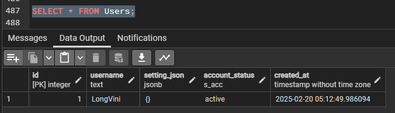

# Практика 20225
# Куліковський Денис IПЗ-4.01

## Завдання
1. Розробка тестового білду мобільної гри-симулятора ферми "Fogwood" з елементами економічної стратегії
2. Створення базової архітектури проєкту на Unity
3. Імплементація системи взаємодії користувача з ігровими об'єктами
4. Розробка авторизації користувачів на базі Google Play
5. Підключення веб-сокета для швидкої синхронізації даних між клієнтом і сервером

## Виконані завдання

Під час практики було виконано низку ключових задач, що дозволили створити фундамент для подальшої розробки гри-симулятора ферми "Fogwood":

### Розробка ігрової локації та тестових об'єктів

На рисунку 1 зображено початкову зону з декількома тестовими об'єктами:
- домівка: представляє собою об'єкт типу Building та включає у себе можливість переносу по полю;
- слайми: поодинокі вороги, з якими потрібно буде битися, об'єкти типу Enemy;
- скрині: об'єкти Treasure (скарбів), з яких випадає деякий безкоштовний лут;
- бочка: об'єкт Decoration (декоративний);
- трава: об'єкт Destroyable (з можливістю руйнування), для знищення використовує енергію та видає лут.

    

    Початкова сцена гри

### Реалізація системи взаємодії з ігровими об'єктами

Було розроблено комплексну систему взаємодії з різними типами об'єктів:

1. **Взаємодія з Building об'єктом**:
   - при натисканні 1 раз виконується метод OneClick (реалізація інтерфейсу IOneClick);
   - при затисканні кнопки на більше 1 секунди, якщо поле isMoveable має значення «True», тоді стан гри зміниться на Moveable та з'являться кнопки «Rotate», «Install» і «Cancel».

    

    Переміщення об'єкта типу Building

2. **Взаємодія з Enemy об'єктом**:
   - при натисканні на enemy один раз буде показано його характеристики (заплановано, але не реалізовано у тестовому білді).

3. **Взаємодія з Treasure об'єктом**:
   - при натисканні з нього в залежності від шансу вдачі випадає декілька різних об'єктів, а сам об'єкт зникає.

    

    Скриня зникла з ігрового поля

    

    Отримання нагороди зі скрині

4. **Взаємодія з Decoration об'єктом**:
   - при затисканні кнопки на більше 1 секунди вмикається стан Moveable, як у попередньому типі, але додатково з'являється кнопка «Storage» (перенесення на склад).

    

    Переміщення декоративного об'єкту

5. **Взаємодія з Destroyable об'єктом**:
   - при натисканні з'являється повідомлення з описом предмета та необхідною кількістю енергії для знищення;
   - при подвійному натисканні на об'єкт заплановано, що він зникає та випадає дроп (не реалізовано у тестовому білді).

    

    Повідомлення з описом Destroyable об'єкта

### Тестування на мобільних пристроях

Було проведено тестування гри за допомогою інструменту Unity Remote, що дозволило налагодити взаємодію з грою безпосередньо на мобільному пристрої:

    

    Тестування на мобільному пристрої з використанням Unity Remote

    

    Вигляд інтерфейсу гри на мобільному пристрої

### Розробка авторизації та мережевих компонентів

У рамках практики було реалізовано авторизацію користувачів на базі Google Play, яка дозволяє гравцям зберігати свій прогрес. Ця система допомагає гравцям не втрачати свої досягнення навіть при зміні пристрою.

    

    Інтерфейс привітання авторизованого користувача

Для передачі даних було налаштовано веб-сокет комунікацію. Сервер був створений локально в мережі на ASP.NET, що дало змогу тестувати гру прямо з телефона. Всі дані про гравців зберігаються в базі даних.

    

    Консоль сервера з повідомленнями веб-сокета

    

    База даних із записом користувача

Створена система дозволяє обробляти запити від гравців та синхронізувати дані між пристроями. Використання локального сервера допомогло швидше тестувати різні частини гри. Це зробило процес розробки більш зручним.

Система авторизації та збереження даних створює основу для подальшої розробки гри, включаючи додавання функцій взаємодії між гравцями.
